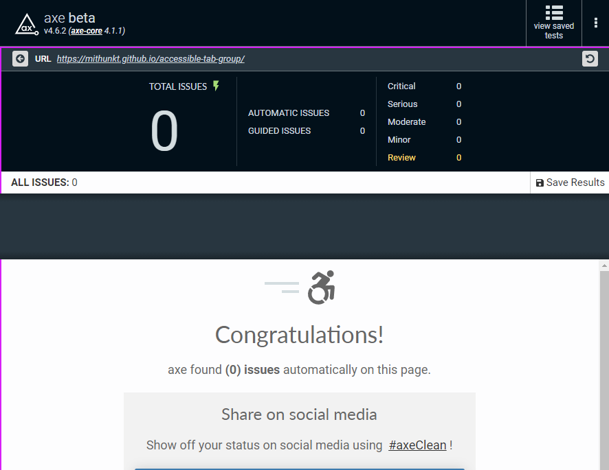
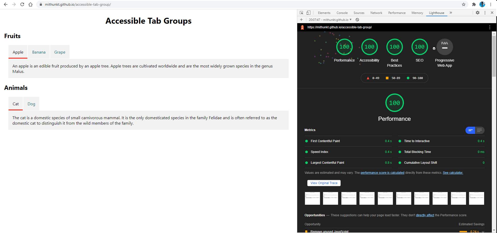

# Accessible Tab Group

Accessible tab group with WAI ARIA specification. Implementation is with the horizontal orientation and automatic activation.

Tab state is persisted with hash value in URL. 

Tech Stacks: `React`, `Typescript`

App is live at https://mithunkt.github.io/accessible-tab-group/

### How to setup

Install dependencies
```
npm install
```

### How to run

Execute the following command to run the application on localhost
```
npm run start
```
### How to run tests
Execute the following command to run the tests
```
npm run test
```

## Keyboard Interactions for tablist
* `Tab`: When focus moves into the tab list, places focus on the active tab element. When the tab list contains the focus, moves focus to the next element in the tab sequence, which is the tabpanel element.
* `Left Arrow`: moves focus to the previous tab. If focus is on the first tab, moves focus to the last tab. Activates the newly focused tab.
* `Right Arrow`: Moves focus to the next tab. If focus is on the last tab element, moves focus to the first tab. Activates the newly focused tab .
* `Space` or `Enter`: Activates the tab if it was not activated automatically on focus.
* `Home`: Moves focus to the first tab and activates the newly focused tab.
* `End`: Moves focus to the last tab and activates the newly focused tab.

## Possible Enhancements

* Handling vertical orientation for tablists.
* `Delete` keyboard interaction for the tab.
* Keyboard interaction with Modal popup associated with tab group.
* State persistence with keyboard interaction.

### Accessibility Tests

